<div align="center">

# RenderDoc for VS Code

**Inspect, analyze, and debug GPU captures — without leaving your editor.**

[](https://code.visualstudio.com/)
[](LICENSE)
[](https://modelcontextprotocol.io/)
[]()

*A native-backed RenderDoc frontend, reimagined for the modern editor workflow.*

</div>

---

## Overview

**RenderDoc for VS Code** brings the full power of the RenderDoc graphics debugger into Visual Studio Code. Open any `.rdc` capture file and get an instant, first-class inspection experience — hierarchical draw call timelines, live shader source, full pipeline state, texture and buffer inspection, GPU timing profiling, project-source mapping, Mali shader analysis, and a local MCP endpoint for AI-powered analysis via any MCP-capable client.

No context switching. No external viewers. Just your capture, your editor, and your agent.

---

## Highlights

<table>
<tr>
<td width="50%" valign="top">

### Full Capture Inspector
A dedicated, tabbed inspector panel with **Overview**, **Pipeline**, **Shaders**, **Textures**, **Mesh**, and **Events** — modeled after RenderDoc's native UI, built for the editor.

</td>
<td width="50%" valign="top">

### Hierarchical Event Browser
Draw-call tree with EID-prefixed labels and group ranges (e.g. `11–559 Camera.Render`). GPU timings (`durationUs`) are shown per event after running **Fetch GPU Timings**.

</td>
</tr>
<tr>
<td width="50%" valign="top">

### Live Texture Previews
Click any draw to see **only the textures that draw actually samples** — render targets, depth buffers, and sampler bindings auto-loaded as thumbnails. ASTC and HDR formats supported natively.

</td>
<td width="50%" valign="top">

### Launch And Capture
Start a **local Windows executable** or a **supported remote device target** directly from VS Code, trigger a frame capture, and auto-open the resulting `.rdc`.

The extension now exposes a dedicated **Capture Target** sidebar view for switching between **Local** and connected devices, plus a **Launch Application** panel for configuring the program/package, arguments, output path, and trigger settings.

</td>
</tr>
<tr>
<td width="50%" valign="top">

### Attach And Capture
Inject into a **running Windows process** or connect to an already running **remote RenderDoc target**, trigger a capture, and open the resulting frame in the inspector.

</td>
<td width="50%" valign="top">

### Native Replay Bridge
A C++ bridge (`renderdoc_bridge.exe`) links directly to RenderDoc's replay DLL — delivering real pipeline state, shader disassembly, descriptor enumeration, and mesh data at native speed.

</td>
</tr>
<tr>
<td width="50%" valign="top">

### AI-Powered Frame Analysis (MCP)
Connect any MCP-capable AI client to the local **RenderDoc For VSCode MCP** endpoint. The server exposes 21 specialized tools — including on-demand action timings, shader and constant-buffer inspection, resource reverse lookups, project-source mapping, and Mali shader analysis results.

</td>
<td width="50%" valign="top">

### Mali Offline Compiler Integration
Analyze any shader directly from the Inspector's Shaders tab using the **Mali Offline Compiler** (`malioc`). Results are shown in a resizable side-by-side panel alongside the shader source, and are also exposed to MCP clients for AI-assisted optimization advice.

</td>
</tr>
</table>

---

## Screenshots

Click any screenshot to open it at full size.

### Capture Overview

[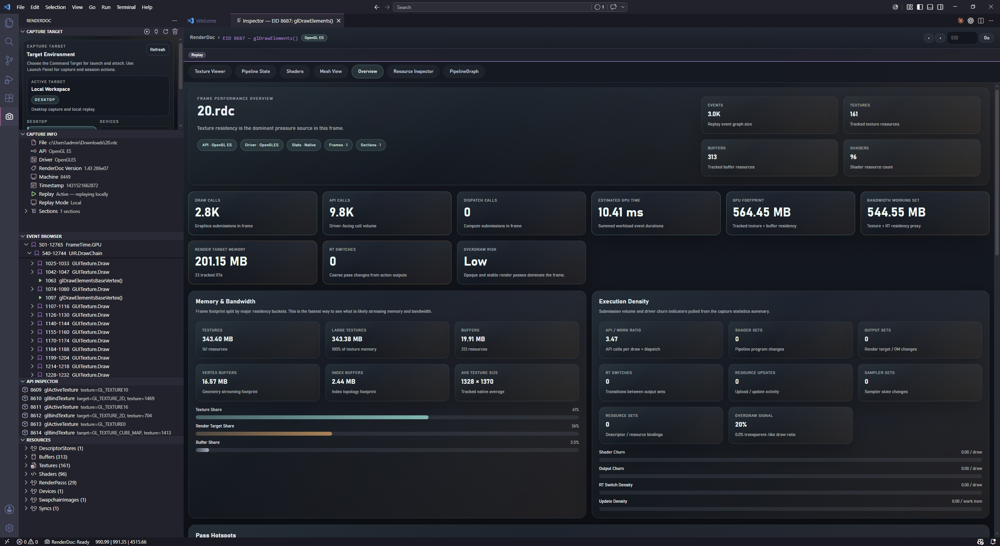](screenshots/capture-overview.jpeg)

**Overview** — frame thumbnail, API and driver metadata, and capture summary.

[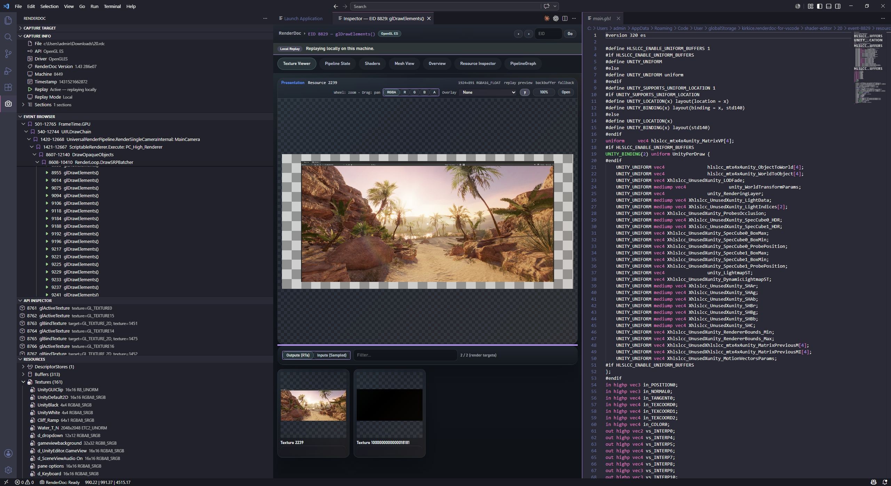](screenshots/draw-calls-and-resources.jpeg)

**Sidebar Views** — Draw Calls, Resources, and selection context in the activity bar.

### Inspector Views

[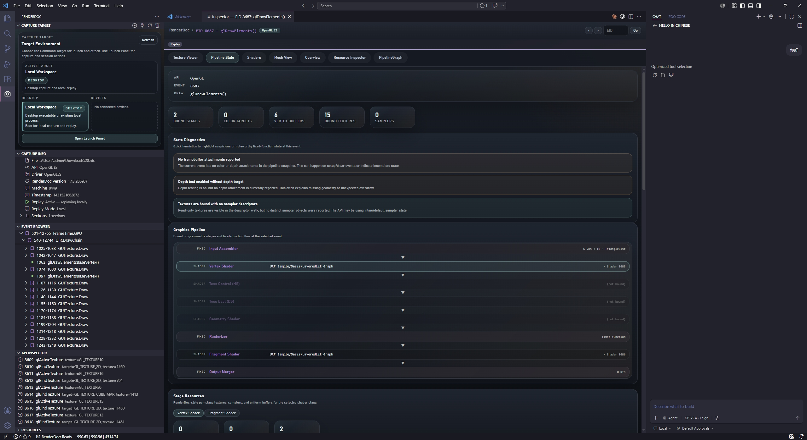](screenshots/pipeline-state.jpeg)

**Pipeline State** — inspect bound stages and per-draw graphics state.

[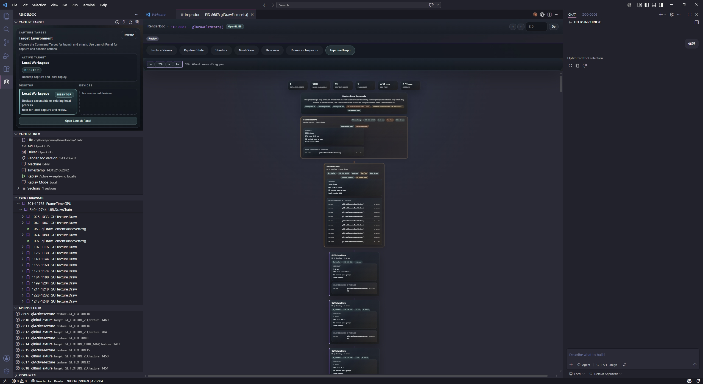](screenshots/pipeline-graph-overview.jpeg)

**Pipeline Graph** — render-flow visualization derived from the full event hierarchy.

[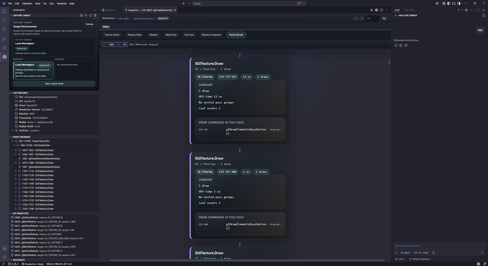](screenshots/pipeline-graph-detail.jpeg)

**Pipeline Graph Detail** — drill into pass groups, representative commands, and selected-event context.

[](screenshots/shaders.jpeg)

**Shaders** — source, disassembly, and shader-stage analysis in one place.

[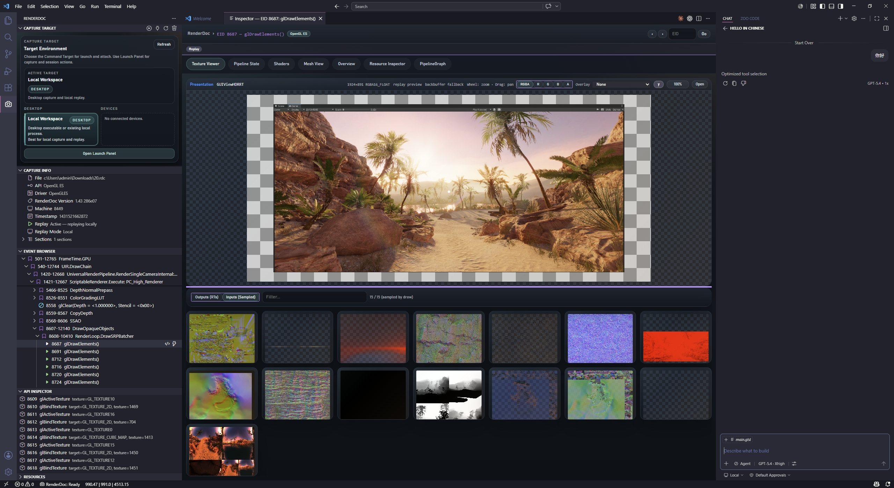](screenshots/texture-view.jpeg)

**Texture View** — inspect render targets and sampled textures for the current draw.

[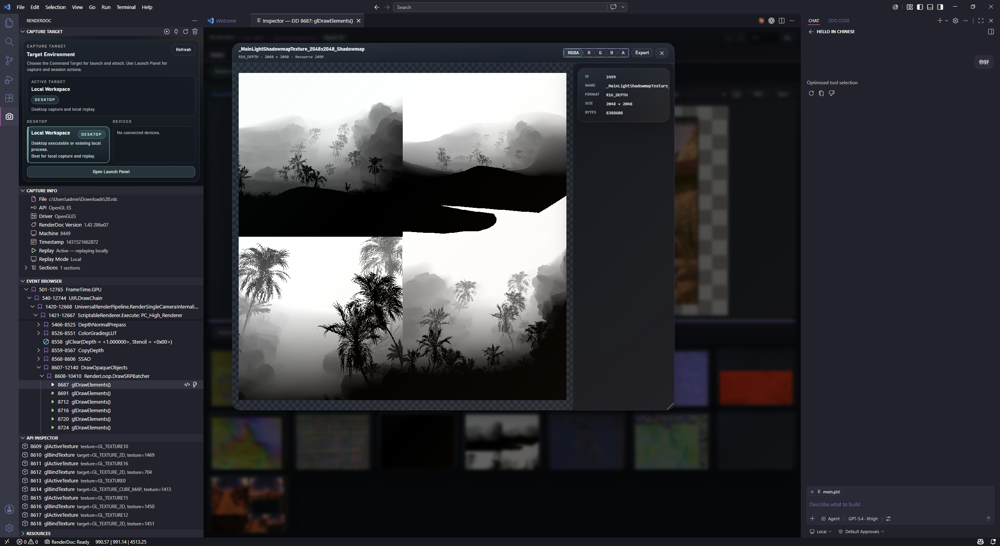](screenshots/texture-info.jpeg)

**Texture Info** — zoom into an individual texture with focused metadata.

[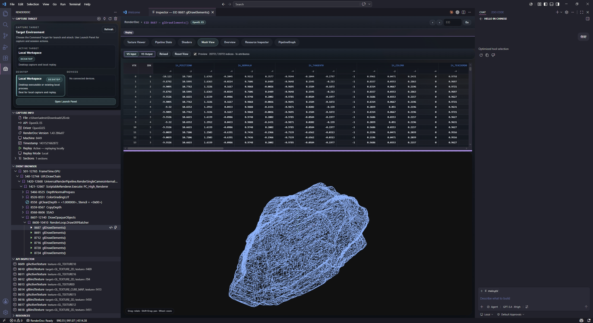](screenshots/mesh-view.jpeg)

**Mesh View** — inspect vertex/index data and geometry layout at a selected event.

[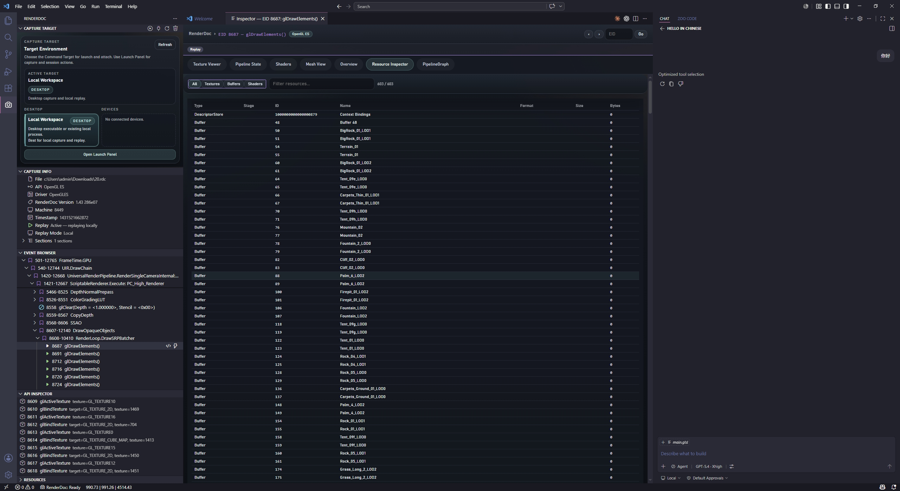](screenshots/resource-inspector.jpeg)

**Resource Inspector** — browse textures, buffers, and shader resources across the capture.

[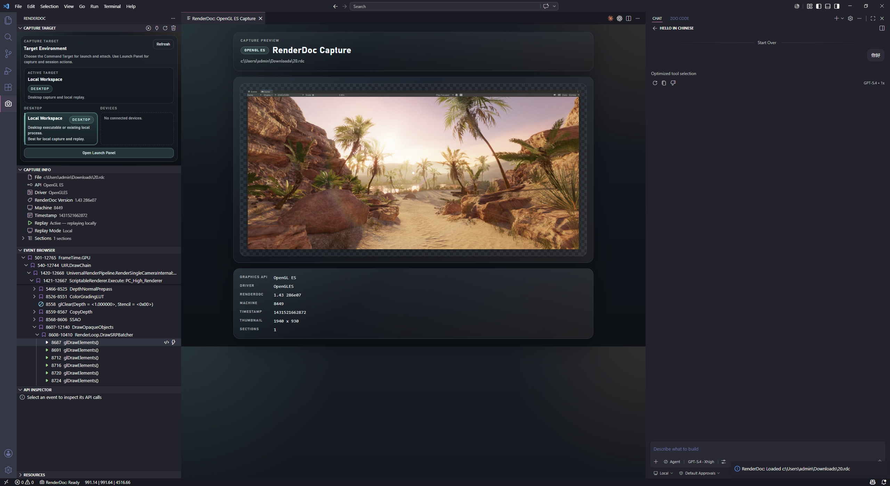](screenshots/inspector-overview.jpeg)

**Overview** — capture metadata, API and driver details, and frame summary.

[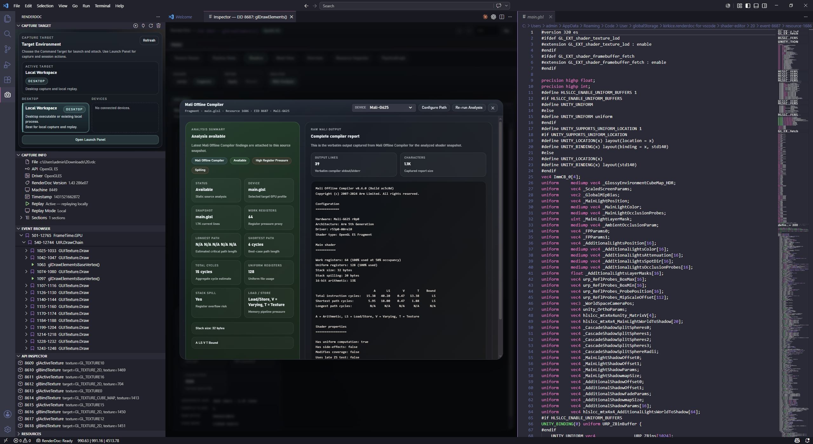](screenshots/mali-offline.jpeg)

**Mali Offline Compiler** — choose a target Mali GPU profile and inspect static shader analysis output.

### Capture Workflow

[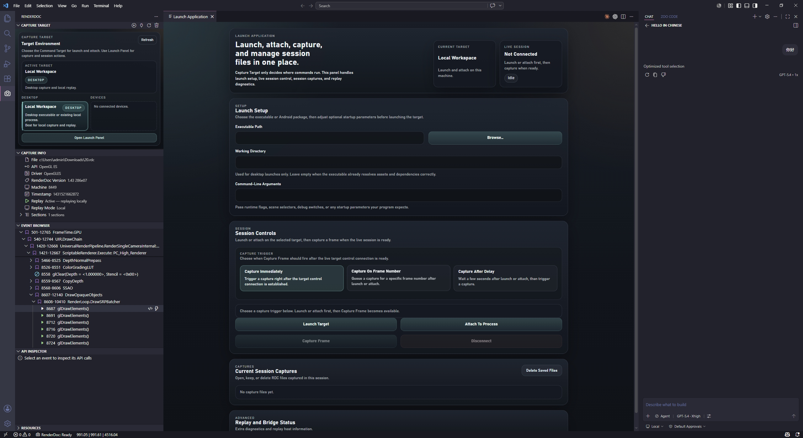](screenshots/launch-panel.jpeg)

**Launch Panel** — configure the target executable, arguments, output path, and capture trigger.

[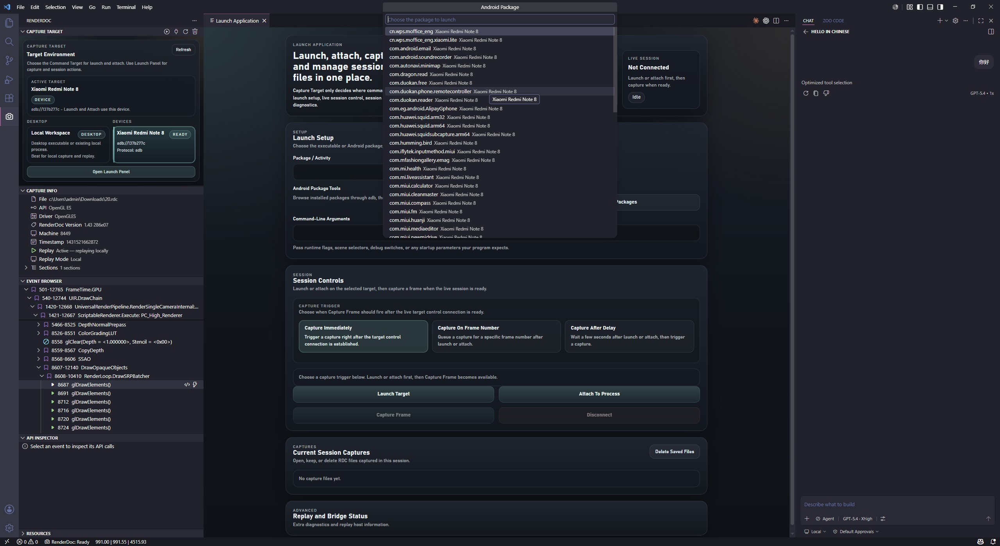](screenshots/capture-target-view.jpeg)

**Capture Target View** — switch between local and remote targets, attach, and trigger captures.

### MCP Workflow

[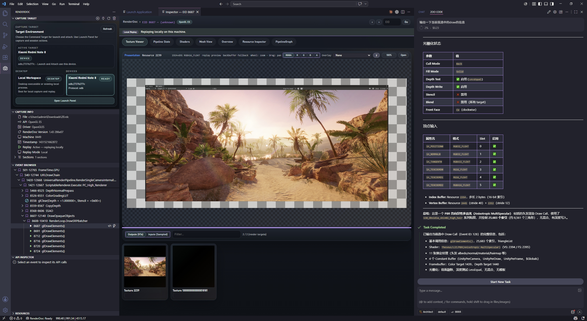](screenshots/mcp-connection-info.jpeg)

**MCP Connection Info** — copy the local endpoint and client snippets for MCP-capable AI tools.

---

## Quick Start

```
1. Install the extension in VS Code 1.95+
2. Run `RenderDoc: Open Launch Panel`, `RenderDoc: Attach On Selected Target`, or open an existing `.rdc`
3. The RenderDoc sidebar appears automatically
4. Click any draw call → Inspector opens beside your editor
5. Run "Fetch GPU Timings" to populate durationUs per draw
6. Connect an MCP-capable AI client (Cline, Roo Code, Claude Code, etc.) to the local MCP endpoint for AI-powered analysis
```

> **Requires:** Packaged VSIX releases can run directly from the bundled `.renderdoc-runtime` and native bridge. When working from source, build `native/build/Release/renderdoc_bridge.exe` and use a local RenderDoc install unless your development package also includes `.renderdoc-runtime`. If a packaged install is damaged or incomplete, run **`RenderDoc: Restore Native Bridge…`** to recover the bundled helper from the latest VSIX.

---

## Usage Guide

### 1 · Installing the Extension

**Option A — from VSIX (recommended):**
```powershell
code --install-extension path/to/renderdoc-for-vscode-<version>.vsix
```
Or: `Extensions` panel → `···` menu → **Install from VSIX…**

GitHub Releases publish a single `.vsix` package for installation. The packaged native bridge and bundled runtime are already included inside that VSIX.

**Option B — from source:** see [Building from Source](#building-from-source).

---

### 2 · Installing RenderDoc (runtime dependency)

The extension loads RenderDoc's replay library (`renderdoc.dll` / `librenderdoc.so`) at runtime. Packaged VSIX releases already bundle `.renderdoc-runtime` and `renderdoc_bridge.exe`, so no separate bridge download is required for the normal installation path.

If you are developing from source, or using a package without the bundled runtime, install RenderDoc locally.

**[renderdoc.org/builds](https://renderdoc.org/builds)** — any stable version **v1.30 or newer**.

| Platform | Common path |
| -------- | ----------- |
| Windows  | `C:\Program Files\RenderDoc\` |
| Linux    | `/usr/lib/x86_64-linux-gnu/librenderdoc.so` |
| macOS    | `/Applications/RenderDoc.app/` |

If you are developing from source, also build the native helper in `native/build/Release/renderdoc_bridge.exe`. Packaged VSIX installs auto-discover both the bundled runtime and the bundled bridge from extension-relative paths.

---

### 3 · Opening a Capture

- **File explorer:** right-click a `.rdc` → **Open RDC Capture**
- **Command palette:** run **RenderDoc: Open Launch Panel** to configure and launch a local executable or supported remote target, then auto-open the captured frame
- **Capture Target view:** select a process/device, then run **RenderDoc: Attach On Selected Target** to attach to a running process or remote RenderDoc target
- **Command palette:** `RenderDoc: Open RDC Capture`
- **Live sessions:** run **RenderDoc: Capture Frame From Live Session** after connecting to a target
- **Drag & drop** a `.rdc` onto the VS Code window

The activity bar shows three sidebar views: **Capture Info**, **Draw Calls**, and **Resources**.

---

### 4 · Inspector Workflow

Click any draw call in the **Draw Calls** tree to open the tabbed Inspector panel.

| Tab          | What you get                                                                           |
| ------------ | -------------------------------------------------------------------------------------- |
| **Overview** | Frame thumbnail, capture metadata, API, GPU driver, file sections                     |
| **Pipeline** | Stage-by-stage flow diagram (IA → VS → RS → FS → OM) with bound shader names         |
| **Shaders**  | Per-stage GLSL/HLSL source with Mali Offline Compiler analysis in a split-pane view   |
| **Textures** | Bound texture grid (scoped to the current draw) with auto-loaded thumbnails            |
| **Mesh**     | Vertex buffer layout, index buffer, input assembly configuration                       |
| **Events**   | Flat EID timeline; GPU `durationUs` shown per row after Fetch GPU Timings             |

Navigation:
- **‹ / ›** buttons — step to previous/next event
- **EID input → Go** — jump directly to any event by number

---

### 5 · GPU Timing Profiling

1. Open the **Draw Calls** sidebar.
2. Click the **Fetch GPU Timings** button (⏱).
3. Each draw call is annotated with its measured GPU time (`durationUs`).
4. Use your MCP-capable AI client to rank draws by cost, summarize hot passes, or drill into a specific hot EID.

---

### 6 · Mali Offline Compiler Integration

1. Install the [Mali Offline Compiler](https://developer.arm.com/Tools%20and%20Software/Mali%20Offline%20Compiler) from Arm Developer.
2. Set `renderdoc.maliOfflineCompilerPath` to the path of `malioc.exe` in VS Code Settings.
3. In the Inspector → **Shaders** tab, click **Analyze with Mali Offline Compiler**.
4. The analysis result appears in a resizable pane beside the shader source.
5. Ask your MCP client for optimization suggestions — it has access to the Mali analysis output.

---

### 7 · AI-Powered Analysis via MCP

Connect any MCP-capable AI client (Cline, Roo Code, Zoo Code, Claude Code, etc.) to the local **RenderDoc For VSCode MCP** endpoint exposed by this extension. The default endpoint is `http://127.0.0.1:38967/mcp`, but you should prefer the actual URL shown in the sidebar GUI because the configured port can differ. In the **Capture Target** view, use **Local MCP → One-Click Configure** first. That button enables MCP if needed, starts the local server, and auto-writes workspace config files with the actual current URL. If you need to inspect or copy the final endpoint manually, click **MCP Info** in the same card or run **RenderDoc: Show RenderDoc For VSCode MCP Info**.

#### External MCP Client Setup

Use this checklist when helping a teammate connect **Roo Code**, **Zoo Code**, **Claude Code**, **Codex/CodeX**, or another non-Copilot client:

1. Install this extension in VS Code and open the target `.rdc` capture in the same VS Code window.
2. In the **Capture Target** view, find the **Local MCP** card and click **One-Click Configure**. This enables MCP if needed, starts the server, and updates `.vscode/mcp.json` and `.roo/mcp.json` in the current workspace so VS Code workspace MCP and Roo/Zoo project config both point at the actual current endpoint.
3. Confirm that the **Local MCP** card now shows the running status and actual port number.
4. If you need to inspect or copy the final URL manually, click **MCP Info** in that same card or run **RenderDoc: Show RenderDoc For VSCode MCP Info**.
5. In the external AI client, add one MCP server named `renderdoc-for-vscode` that points to that local URL only if the client does not already read one of those workspace config files.
6. After the client connects, have it call `renderdoc_openCapture` first without `filePath` if capture state is unknown. That lets the extension resolve the already opened capture from this VS Code window.

VS Code workspace MCP uses `.vscode/mcp.json` with root `servers` and `type: "http"`:

```json
{
    "servers": {
        "renderdoc-for-vscode": {
            "type": "http",
            "url": "http://127.0.0.1:38967/mcp"
        }
    }
}
```

Roo Code, Zoo Code, and most generic MCP clients use a config with root `mcpServers` and `type: "streamable-http"`:

```json
{
    "mcpServers": {
        "renderdoc-for-vscode": {
            "type": "streamable-http",
            "url": "http://127.0.0.1:38967/mcp"
        }
    }
}
```

Client notes:

- `Roo Code` / `Zoo Code`: prefer the sidebar **Local MCP → One-Click Configure** button. It writes project `.roo/mcp.json` for you. If your teammate uses a global `mcp_settings.json` instead, use **MCP Info** and paste the generic snippet there.
- `Claude Code`: add a remote HTTP MCP server named `renderdoc-for-vscode`. If it asks for a transport, choose `streamable-http` or the equivalent HTTP streaming option. If it accepts raw JSON config, use the generic `mcpServers` snippet above.
- `Codex` / `CodeX`: use the same generic remote MCP server settings as Claude Code. Choose an HTTP or `streamable-http` transport, not a local `stdio` server.
Common gotchas:

- The MCP endpoint reflects the capture opened in this VS Code window, not a global RenderDoc session from some other app.
- The fastest setup path is the sidebar **Local MCP → One-Click Configure** button. The command-palette workflow is now just a fallback.
- If the client connects but sees no useful context, open the capture in VS Code first or ask it to call `renderdoc_openCapture` with no `filePath`.
- If a client offers both `stdio` and HTTP transports, use HTTP / `streamable-http` for this extension.
- If you changed `renderdoc.mcpServer.port`, update the URL in the client config to match.

Recommended first test prompt for teammates:

```text
Open the current RenderDoc capture, summarize the top-level passes in this frame, and if capture state is unknown call renderdoc_openCapture first with no filePath.
```

Typical prompts for your MCP client:

```text
Analyze the fragment shader for EID 495 and suggest optimizations
Find all draw calls rendering to the shadow map
Show pipeline state diff between EID 300 and EID 355
Which textures are bound at the currently selected draw?
这个帧大概有哪些 pass？先给我一个结构概览。
当前选中的这个 Draw 绑定了哪些纹理？
帮我分析 EID 495 的 fragment shader，并看看它在工程里对应哪个 shader/pass 实现。
这个 ResourceId 对应的 buffer 前 256 字节是什么？
```

The MCP tools can use your **active Inspector selection** (focused EID, draw call, sidebar resource), so natural references like *"this draw"* or *"the current event"* resolve automatically.

Available MCP tools:

Context and overview:

| Tool | Description |
| ---- | ----------- |
| `#openCapture` | Resolve the active or open `.rdc` in this VS Code window, or load a specific capture by `filePath` |
| `#selectionContext` | Current Inspector focus: selected EID, draw call, sidebar resource, replay status, and related context |
| `#captureInfo` | Capture metadata: API, driver, version, file sections, and capture summary |
| `#frameSummary` | High-level frame structure: top-level passes/markers, draw counts, and capture stats |
| `#analyzeFrame` | Holistic frame analysis with flagged issues and suggested next inspection steps |

Events and timings:

| Tool | Description |
| ---- | ----------- |
| `#drawCalls` | Full draw call tree with marker hierarchy, filtering, and `durationUs` when timings are available |
| `#actionTimings` | Fetch GPU timings on demand, optionally filtered by event IDs or marker groups |
| `#eventDetails` | Full details for one EID, including richer pipeline context when replay is active |
| `#pipelineState` | Complete pipeline state at a given EID |

Shaders and resources:

| Tool | Description |
| ---- | ----------- |
| `#shaderSource` | Raw GLSL/HLSL source for the bound shader stages at an EID |
| `#shaderInfo` | Higher-level shader analysis with bindings, samplers, and decoded constant buffers |
| `#resources` | Paginated list of textures, buffers, and shaders in the capture |
| `#resourceDetail` | Detailed information for a specific resource ID |
| `#textureInfo` | Texture metadata and identity lookup |
| `#textureData` | Texture pixel data sampled at a specific event/mip and returned as PNG data |
| `#bufferContents` | Raw bytes from a GPU buffer with offset/length paging |

Reverse lookups and source mapping:

| Tool | Description |
| ---- | ----------- |
| `#findDrawsByShader` | Reverse-search draw calls by shader name or entry point |
| `#findDrawsByTexture` | Reverse-search draw calls by sampled texture name |
| `#findDrawsByResourceId` | Reverse-search draw calls by exact resource ID |
| `#projectImplementation` | Search the open workspace for likely shader/pass implementation files related to a capture event |

The MCP server includes built-in workflow instructions that guide AI clients through the optimal analysis path: selection context first, frame overview, performance drill-down, shader/texture/buffer inspection, and project source mapping.

---

### 8 · Exporting Resources

- **Texture → PNG:** right-click a texture in **Resources** → **Export Texture** (ASTC, HDR, sRGB handled automatically)
- **Shader source:** Inspector → Shaders tab → **Copy** button, or **Open in Editor** for a full VS Code buffer

---

### 9 · Troubleshooting

| Symptom | Fix |
| ------- | --- |
| "Native bridge not available" / empty shaders | If you are running from source, build `native/build/Release/renderdoc_bridge.exe`. If you installed from VSIX and the helper is missing, run **RenderDoc: Restore Native Bridge…**. Replay also needs either a bundled `.renderdoc-runtime` or a local RenderDoc install. |
| Inspector stays blank after clicking a draw | `Developer: Reload Window` — auto-recreates the panel |
| Textures tab shows nothing | The draw has no sampled inputs/RTs, or pipeline is still loading |
| Mali Offline Compiler button missing | Set `renderdoc.maliOfflineCompilerPath` to the path of `malioc.exe` |
| GPU timings show `N/A` | Click **Fetch GPU Timings** in the Draw Calls sidebar first |
| Capture recommends a remote replay host | Connect a compatible target, use **RenderDoc: Try Local Replay**, or set `renderdoc.alwaysReplayLocally` if you do not want the prompt |

---

## Architecture

```
┌──────────────────────────────────────────────────────────────────────┐
│                        VS Code Extension Host                        │
│  ┌──────────────┐   ┌──────────────────┐   ┌──────────────────────┐  │
│  │   Sidebar    │   │    Inspector     │   │    MCP Server        │  │
│  │   Views      │   │    Webview       │   │  (21 tools, HTTP)    │  │
│  └──────┬───────┘   └────────┬─────────┘   └──────────┬───────────┘  │
│         └────────────────────┼────────────────────────┘              │
│                              ▼                                       │
│                   ┌─────────────────────┐                            │
│                   │   RenderDocBridge   │  ← TypeScript JSON-RPC     │
│                   └──────────┬──────────┘                            │
└──────────────────────────────┼───────────────────────────────────────┘
                               │ stdin / stdout
                               ▼
                   ┌───────────────────────┐
                   │  renderdoc_bridge.exe │  ← C++ native bridge
                   │  (links to RenderDoc) │
                   └───────────┬───────────┘
                               │ IReplayController
                               ▼
                   ┌───────────────────────┐
                   │ renderdoc.dll runtime │
                   └───────────────────────┘
```

The native bridge maintains a long-lived replay session, caches pipeline state per EID, and streams results as JSON — shader disassembly, descriptor access, GPU timings, and texture readback all execute at native speed.

---

## Project Layout

```
renderdoc-for-vscode/
├── src/
│   ├── extension.ts              # Activation, command registration
│   ├── renderdocBridge.ts        # Native bridge client (JSON-RPC over stdio)
│   ├── rdcParser.ts              # Pure-TS .rdc header/section parser
│   ├── views/                    # Sidebar tree providers + Inspector webview
│   │   ├── inspectorPanel.ts     # Main Inspector panel (IPC, Mali analysis)
│   │   └── inspector/html.ts     # Inspector HTML template generation
│   └── copilot/
│       ├── tools.ts              # MCP tool implementations
│       └── toolRegistry.ts       # Tool definitions and schemas
├── native/
│   ├── include/                  # RenderDoc public headers (vendored)
│   ├── 3rdparty/                 # ASTC decoder, stb_image_write
│   ├── src/                      # main.cpp, dll_loader.cpp, json.hpp
│   └── CMakeLists.txt
├── .renderdoc-runtime/           # Bundled RenderDoc runtime for packaged VSIX releases
├── media/inspector/              # Webview frontend (JS + CSS)
├── package.json
├── tsconfig.json
└── LICENSE
```

---

## Building from Source

### Prerequisites

- **Node.js** 18+ and npm
- **CMake** 3.20+ with a C++17 compiler (MSVC 2019+ / Clang 12+ / GCC 10+)
- **RenderDoc** installed locally (replay DLL required at runtime)

### Build

```powershell
# TypeScript extension
npm install
npm run compile

# C++ native bridge (Windows / MSVC)
cd native
cmake -B build -A x64
cmake --build build --config Release
```

The compiled `renderdoc_bridge.exe` is discovered automatically by the extension at runtime.

### Run in Development

Press `F5` in VS Code — launches an Extension Development Host with the extension loaded and the debugger attached.

---

## Configuration

| Setting | Default | Description |
| ------- | ------- | ----------- |
| `renderdoc.commandTimeout` | `60000` | Timeout in milliseconds for `renderdoccmd` operations such as thumbnail fallbacks |
| `renderdoc.alwaysReplayLocally` | `false` | Skip the replay-host prompt and continue locally when a capture suggests remote replay |
| `renderdoc.maliOfflineCompilerPath` | *(empty)* | Path to `malioc.exe` for shader analysis |
| `renderdoc.mcpServer.enabled` | `true` | Expose the optional local RenderDoc For VSCode MCP endpoint for other AI clients |
| `renderdoc.mcpServer.port` | `38967` | TCP port used by the local RenderDoc For VSCode MCP server |

Packaged VSIX installs auto-discover the bundled runtime and native bridge when they are present. Extra setup is typically only needed for source builds or optional Mali analysis.

---

## Supported APIs

| API | Capture Load | Pipeline State | Shader Source | Texture Preview | GPU Timings |
| --- | :---: | :---: | :---: | :---: | :---: |
| **Vulkan** | ✅ | ✅ | ✅ | ✅ | ✅ |
| **D3D12** | ✅ | ✅ | ✅ | ✅ | ✅ |
| **D3D11** | ✅ | ✅ | ✅ | ✅ | ✅ |
| **OpenGL** | ✅ | ✅ | ✅ | ✅ | ✅ |
| **OpenGL ES** | ✅ | ✅ | ✅ | ✅ | ✅ |

---

## Contributing

Pull requests are welcome. For significant changes, open an issue first to discuss the design.

1. Fork the repository
2. Create a feature branch: `git checkout -b feat/my-feature`
3. Write conventional commit messages
4. Open a PR targeting `main`

---

## License

Released under the [MIT License](LICENSE).

RenderDoc is © Baldur Karlsson and contributors, licensed under the MIT License.

---

<div align="center">

*Built for graphics engineers who live in VS Code.*

</div>
