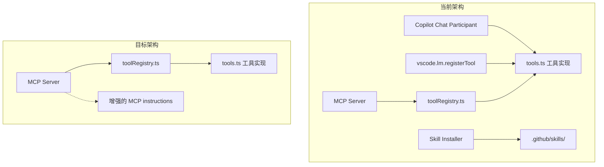

# 移除 Copilot 依赖 — 全面迁移到 MCP

## 目标

移除扩展对 GitHub Copilot 的所有依赖（Chat Participant、Language Model Tools 注册、Skill Installer），仅保留 MCP Server 作为 AI 集成通道。目标客户端为 Cline、Zoo Code、Roo Code 等 MCP 客户端。

## 可行性结论

**完全可行。** 当前架构中 MCP Server 和 Copilot 共享同一套工具实现（`tools.ts` + `toolRegistry.ts`），MCP Server 已经具备全部 21 个工具的完整能力。移除 Copilot 不影响 MCP Server 的功能。

## 当前架构 vs 目标架构



## 变更清单

### 1. 删除文件

| 文件 | 原因 |
|------|------|
| `src/copilot/chatParticipant.ts` | Copilot Chat Participant 实现 |
| `src/copilot/skillInstaller.ts` | Copilot Skill/Instructions 安装器 |
| `.github/skills/renderdoc-analysis/SKILL.md` | Copilot Skill 定义 |
| `.github/skills/renderdoc-analysis/references/workflows.md` | Copilot Skill 参考文档 |
| `.github/skills/renderdoc-analysis/references/ownership.md` | Copilot Skill 参考文档 |
| `.github/skills/renderdoc-unity-analysis/SKILL.md` | Copilot Skill 定义 |
| `.github/skills/renderdoc-unity-analysis/references/workflows.md` | Copilot Skill 参考文档 |
| `.github/copilot-instructions.md` | Copilot 全局指导 |

### 2. 修改文件

#### `src/copilot/toolRegistry.ts`

- **删除** `registerAllTools()` 函数（调用 `vscode.lm.registerTool`，仅 Copilot 使用）
- **保留** `RENDERDOC_TOOL_REGISTRY` 常量和 `RenderDocToolDefinition` 接口（MCP Server 依赖）

#### `src/extension.ts`

- **删除** Copilot 相关 import：
  - `initChatParticipant`, `registerChatParticipant` from `chatParticipant.ts`
  - `ensureBundledCopilotCustomizationsInstalled`, `reinstallBundledCopilotCustomizations` from `skillInstaller.ts`
- **删除** `ensureBundledCopilotCustomizationsInstalled(context)` 调用（activate 函数中）
- **删除** Copilot 集成块（约 L1983-L1995）：
  ```typescript
  const copilotExtension = vscode.extensions.getExtension('github.copilot-chat');
  if (copilotExtension) { ... }
  ```
- **删除** `showCopilotToolStatus()` 函数
- **删除** 命令注册：
  - `renderdoc.reinstallCopilotCustomizations`
  - `renderdoc.showCopilotToolStatus`

#### `package.json`

- **删除** `contributes.chatParticipants` 整个 section
- **删除** `contributes.languageModelTools` 整个 section
- **删除** `activationEvents` 中的 Copilot 相关项：
  - `onChatParticipant:renderdoc`
  - 所有 `onLanguageModelTool:renderdoc_*`（共 21 个）
- **删除** 命令：
  - `renderdoc.reinstallCopilotCustomizations`
  - `renderdoc.showCopilotToolStatus`
- **保留** `activationEvents` 中的非 Copilot 项：
  - `onStartupFinished`
  - `onLanguage:rdc`
  - `workspaceContains:**/*.rdc`

#### `src/mcp/server.ts`

- **增强** MCP Server 的 `instructions` 字段，将 Skill 中的核心工作流指导迁移进来（见下方详细内容）

### 3. 保留不变的文件

| 文件 | 原因 |
|------|------|
| `src/copilot/tools.ts` | 工具实现，MCP Server 直接调用 |
| `src/copilot/toolRegistry.ts`（部分） | 工具注册表，MCP Server 依赖 |
| `src/mcp/server.ts` | MCP Server 核心 |
| `src/mcp/clientConfigSync.ts` | MCP 客户端配置同步 |
| 所有 `src/views/` | UI 层，与 AI 集成无关 |
| 所有 `src/ipc/` | 原生桥接 IPC，与 AI 集成无关 |

## MCP Server Instructions 增强方案

当前 MCP Server 的 instructions 只有 4 行简短说明。Skill 文件中有大量有价值的工作流指导，应迁移到 instructions 中。建议的增强内容：

```
RenderDoc For VSCode MCP — Capture Analysis Tools

Core rules:
- All capture facts must come from renderdoc_* tools. Never invent event IDs, resource IDs, shader code, or timings.
- If capture state is unknown, call renderdoc_openCapture with no filePath first.
- For questions about the current selection or focused draw, call renderdoc_getSelectionContext first.

Workflow routing:
- Frame overview or performance: start with renderdoc_getFrameSummary, then renderdoc_getActionTimings if timing data is needed.
- Performance analysis: identify hottest passes or leaf draws first, then drill into the hottest EIDs. Do not stop at a flat ranking.
- For each hot draw: inspect geometry pressure (numIndices, numInstances, topology, renderdoc_getMeshData), then shader pressure (renderdoc_getShaderInfo), then texture pressure (renderdoc_getResourceDetail).
- For a specific EID: start with renderdoc_getEventDetails. Prefer renderdoc_getShaderInfo for shader+bindings analysis. Use renderdoc_getPipelineState for broader state inspection.
- For texture or resource tracing: start with renderdoc_getResourceDetail or renderdoc_getTextureInfo. Use renderdoc_findDrawsByTexture/Shader/ResourceId for reverse lookups.
- For buffer inspection: identify the exact buffer first, fetch a small slice by default, use offset+len to paginate.
- For project source mapping: use renderdoc_findProjectImplementation with the hot EID or derived shader/pass names.

Response guidelines:
- Reference events as EID <n>. Include full marker hierarchy path for expensive draws.
- Distinguish confirmed capture facts from inferred causes and follow-up hypotheses.
- Summarize findings instead of echoing raw JSON.
- For optimization reports, organize by: timing evidence, geometry pressure, shader complexity, texture pressure, overdraw status, and prioritized fixes.
```

## 迁移步骤（执行顺序）

1. **增强 MCP Server instructions** — 将 Skill 工作流内容写入 `server.ts`
2. **修改 `toolRegistry.ts`** — 删除 `registerAllTools()`
3. **修改 `extension.ts`** — 删除 Copilot 激活和命令注册
4. **修改 `package.json`** — 删除 Copilot contributes、activationEvents、commands
5. **删除 Copilot 文件** — `chatParticipant.ts`、`skillInstaller.ts`
6. **删除 Skill 文件** — `.github/skills/` 目录和 `copilot-instructions.md`
7. **更新 README.md** — 移除 Copilot Chat 相关文档，更新 MCP 使用指南
8. **验证构建** — `npm run typecheck` + `npm run compile`

## 风险评估

| 风险 | 影响 | 缓解措施 |
|------|------|----------|
| `vscode.LanguageModelTool` 类型依赖 | 低 — 这些是 VS Code API 类型，不依赖 Copilot 扩展 | 无需处理 |
| MCP Server 的 `invokeLanguageModelTool` 使用 `vscode.CancellationTokenSource` | 无 — 这是 VS Code API，不依赖 Copilot | 无需处理 |
| 用户已安装 Copilot 且依赖 `@renderdoc` | 中 — 功能丧失 | README 中说明迁移到 MCP 客户端 |
| `tools.ts` 中 `InspectorPanel.currentPanel` 引用 | 无 — 与 Copilot 无关 | 无需处理 |

## 不受影响的功能

- 扩展核心 UI（Sidebar Views、Inspector Panel、Draw Overlay）
- 原生桥接（renderdoc_bridge.exe）
- 捕获加载/触发/附加工作流
- MCP Server 全部 21 个工具
- MCP 客户端配置同步（`.vscode/mcp.json`、`.roo/mcp.json`、`.cline/mcp.json`）
- Mali Offline Compiler 集成
- Shader 编辑器
