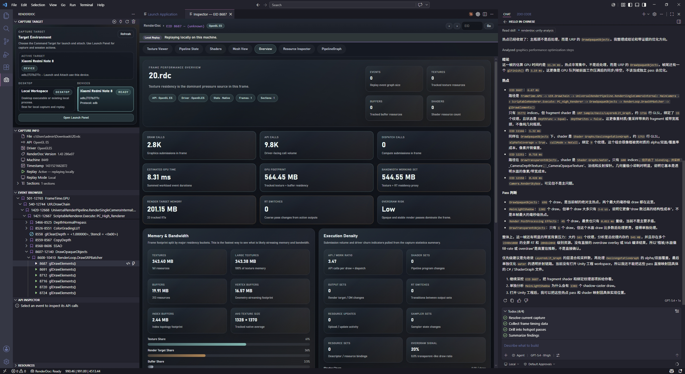

# RenderDoc For VSCode：在 VS Code 中完成 Capture 分析、Shader 检视与 AI 协同

> RenderDoc For VSCode 是一个面向现代图形开发工作流的 VS Code 扩展。它将 RenderDoc Capture 分析、Shader 检视、工程定位与 AI 协同整合到同一编辑器上下文中，帮助开发者减少工具切换，提升问题定位与调试效率。

---

## 产品简介

RenderDoc For VSCode 提供了一套围绕 GPU 调试与渲染分析场景构建的编辑器内工作台，当前已经支持：

- 直接打开 `.rdc` capture
- 浏览 Draw Call、Pipeline、Shader、Texture、Mesh 与 API 调用信息
- 在 VS Code 中完成本地启动捕获、进程附加与远端 Capture Target 协作
- 在 Inspector 中集成 Mali Offline Compiler 分析能力
- 通过 GitHub Copilot 与外部 MCP 客户端访问当前 capture 上下文

它的目标不是做一个简单的 capture 查看器，而是将抓帧、分析、定位与协同尽量收敛到同一条工作流中。

---

## 为什么要在 VS Code 中做 RenderDoc 工作流

在图形开发中，RenderDoc 一直是非常重要的基础工具，但实际调试流程往往仍然是割裂的。

一个典型的问题排查过程通常包括：

1. 使用 RenderDoc 抓取一帧。
2. 在原生界面中检查 draw、pipeline、shader 与 resource。
3. 记录某个 EID、ResourceId 或 shader 名称。
4. 回到 IDE 或编辑器中搜索工程实现。
5. 再回到 capture 对照分析结果。
6. 如果需要 AI 协助，还要额外整理并补充上下文。

单个工具本身并不缺乏能力，真正影响效率的是上下文在多个工具之间反复中断。

RenderDoc For VSCode 试图解决的正是这一点：让 capture inspection、工程代码定位、shader 分析与 AI 协同尽可能在同一个编辑器环境中连续发生。

---

## 核心能力

### 1. 直接在 VS Code 中打开 RenderDoc Capture

打开 `.rdc` 文件后，侧边栏会提供完整的 capture 相关视图，包括：

- Capture Info
- Event Browser
- API Inspector
- Capture Target

开发者可以从事件树快速进入指定 Draw Call，并直接打开 Inspector 继续分析。这使得 capture 浏览不再依赖于额外窗口切换，而是自然地融入编辑器工作区。

---

### 2. Inspector 提供完整的分析面板，而不是简化视图

Inspector 当前已经覆盖图形调试中最核心的几个观察面：

- Overview
- Pipeline
- Shaders
- Textures
- Mesh
- Events

在这些标签页中，可以直接查看：

- 当前 draw 的 pipeline state
- 各 shader stage 的源码与反汇编结果
- 当前 draw 采样的纹理与资源信息
- mesh、vertex 与 index 数据
- 事件链路与 GPU timing

这意味着很多原本只能在 RenderDoc 原生窗口中完成的分析动作，现在可以直接在 VS Code 内完成，并且与工程代码保持同一上下文。

---

### 3. 在编辑器中完成启动、附加与抓帧

RenderDoc For VSCode 的定位并不仅限于 capture 查看，而是进一步覆盖了 capture workflow 的入口环节。当前已经支持：

- 启动本地程序并抓帧
- 选择本地或远端 Capture Target
- 附加到正在运行的进程
- 与远端设备协作完成捕获

这项能力的价值在于，它将“抓帧”和“分析帧”放在了同一工作上下文里，减少了工具切换与状态迁移带来的额外成本。

---

### 4. 将 Mali Offline Compiler 接入 Shader 分析链路

对于移动端图形优化场景，仅仅阅读 shader 源码通常并不足够。为此，插件将 Mali Offline Compiler 集成到了 Inspector 的 Shaders 标签页中。

当前支持的流程包括：

- 在 Shader 面板中直接发起 Mali 分析
- 选择目标 Mali 设备 profile
- 查看分析输出结果
- 基于分析结果继续进行 AI 解释与优化讨论

这样可以把 shader 源码、硬件分析结果与后续优化决策放在同一界面内完成，降低移动端 shader 调优的上下文成本。

---

### 5. 让 AI 能够直接读取当前 Capture 上下文

RenderDoc For VSCode 的另一个重要方向，是把 AI 从“脱离现场的聊天工具”变成“理解当前 capture 状态的分析助手”。

如果使用 GitHub Copilot，在当前仓库内无需额外 MCP 配置，即可直接使用本地 `renderdoc_*` 工具读取 capture 信息。

如果使用 Roo、Zoo、Claude Code、Codex 等 MCP 客户端，也可以通过插件暴露的本地 MCP 服务访问当前 VS Code 窗口中的 RenderDoc 上下文。

例如，可以直接围绕当前 capture 提出下面这类问题：

- 当前帧包含哪些 pass
- 当前选中的 draw 绑定了哪些纹理
- 某个 EID 的 fragment shader 为什么开销较高
- 某个 shader 在工程中的实现位置在哪里
- 某个 ResourceId 对应 buffer 的前 256 字节内容是什么

这里的关键不只是“可以提问”，而是 AI 获取到的是当前 Inspector 的实际选择状态，而不是人工转述后的片段信息。

---

## 降低外部 MCP 客户端的接入门槛

对于外部 MCP 客户端而言，真正影响落地效率的往往不是协议本身，而是接入过程中的琐碎细节，例如：

- 本地 MCP 服务是否已经启动
- 当前实际端口号和 endpoint 是什么
- 需要修改哪些工作区配置文件

为了解决这类问题，插件在侧边栏的 Capture Target 视图中增加了独立的 Local MCP 卡片，用于集中展示：

- MCP 是否启用
- MCP 当前是否成功运行
- 当前实际端口号
- 当前 endpoint

同时，插件还提供了 One-Click Configure 按钮，用于自动完成以下动作：

1. 启用 MCP 功能。
2. 拉起本地 MCP 服务。
3. 将当前实际 endpoint 写入工作区 MCP 配置。

这让团队内部的接入流程从“手动确认状态并维护多个 JSON 文件”收敛为一次显式、可见、可重复的配置动作，更适合日常协作与推广使用。

---

## 适用场景

RenderDoc For VSCode 特别适合以下几类使用场景：

### 图形程序员

需要在 shader、draw、pipeline 与 resource 之间高频切换，并且希望在分析 capture 的同时快速回到工程实现。

### 技术美术与图形 TA

需要从材质、pass、纹理绑定、Render Feature 或后处理链路角度观察实际渲染结果，并与项目内容保持联动。

### 引擎开发与渲染架构工作

需要将 capture 中的事件、资源与 shader 快速映射回项目代码与渲染框架实现。

### 希望将 AI 真正纳入图形调试流程的团队

如果团队已经在使用 Copilot、Roo、Zoo、Claude Code 或 Codex，这个插件可以让 AI 基于当前 capture 状态提供更具体、更可执行的分析支持。

---

## 产品定位

RenderDoc For VSCode 并不是对 RenderDoc 的替代，而是对 RenderDoc 能力的一种工作流级整合。

RenderDoc 依然是底层能力与调试基础设施的核心来源，而 RenderDoc For VSCode 的职责，是把这些能力更顺畅地接入到现代编辑器环境中，让 capture 分析、代码定位、shader 处理与 AI 协同变成同一条连续链路。

换句话说，它并不是要重新定义 RenderDoc，而是希望让 RenderDoc 更自然地进入日常开发流程。

---

## 核心价值

如果用一句话概括这个插件的价值，那就是：

**将 GPU 调试从离散的工具切换，转变为连续的上下文工作流。**

传统流程中，开发者往往需要在 RenderDoc、编辑器、终端以及聊天工具之间不断切换；而在 RenderDoc For VSCode 中，抓帧、看帧、改 shader、定位工程实现以及调用 AI 分析，可以更集中地发生在同一个工作区中。

这背后依赖的并不是单一功能点，而是一组完整能力的协同，包括：

- native replay bridge
- capture 状态同步
- shader 与工程实现映射
- Mali 分析集成
- MCP endpoint 暴露与状态显示
- 外部客户端一键配置

这些能力共同构成了一个更完整、更适合团队使用的图形调试前端。

---

## 安装与使用指南

如果希望真正把 RenderDoc For VSCode 用起来，而不只是停留在“知道它能做什么”，最推荐按照下面这条路径完成一次完整体验。从下载安装到 capture 分析，再到 AI 协同，这套流程基本可以覆盖绝大多数首次上手场景。

### 第一步：安装插件

推荐直接安装发布版 VSIX。

你可以通过以下任一方式完成安装：

1. 在 VS Code 的扩展面板中选择 **Install from VSIX...**。
2. 或者通过命令行执行 `code --install-extension renderdoc-for-vscode-<version>.vsix`。

对大多数用户来说，安装 VSIX 之后就可以直接开始使用。发布版已经包含打包好的 native bridge 和 `.renderdoc-runtime`，不需要额外下载独立的桥接程序。

如果是从源码运行开发版本，则需要本地安装 RenderDoc，并构建 `renderdoc_bridge.exe`。但对于正常体验和团队分发场景，直接安装 VSIX 即可。

### 第二步：准备并打开 Capture

安装完成后，建议优先用已有的 `.rdc` 文件开始体验，因为这是最短的上手路径。

可以通过以下几种方式进入 capture：

1. 直接在 VS Code 中打开一个 `.rdc` 文件。
2. 通过命令面板执行 **RenderDoc: Open RDC Capture**。
3. 通过 **RenderDoc: Open Launch Panel** 配置本地程序并直接抓帧。
4. 在 **Capture Target** 视图中选择本地或远端目标，再执行附加或抓帧操作。

当 capture 打开后，侧边栏会出现与分析相关的核心视图，例如 Capture Info、Event Browser、API Inspector 和 Capture Target。到这一步，基础工作环境就已经建立完成。

### 第三步：从 Draw Call 进入 Inspector

完成第一帧打开之后，建议直接从事件树中选择一个 Draw Call 进入 Inspector，因为这里是插件最核心的分析入口。

打开 Inspector 后，可以按照下面的顺序理解界面：

1. 在 **Overview** 中确认 capture 基本信息、API、驱动与帧摘要。
2. 在 **Pipeline** 中查看当前 draw 的图形管线状态与绑定阶段。
3. 在 **Shaders** 中检查各个 stage 的源码与反汇编。
4. 在 **Textures** 中确认当前 draw 实际使用到的输入纹理和目标资源。
5. 在 **Mesh** 中检查 vertex、index 和输入装配信息。
6. 在 **Events** 中沿着事件链继续定位上下文。

如果要做性能分析，建议在 Draw Calls 视图里先执行 **Fetch GPU Timings**。这样事件列表会带上 `durationUs`，后续无论人工查看还是交给 AI 分析，都会更高效。

### 第四步：按需启用 Mali Offline Compiler

如果你的工作重点包含移动端 shader 优化，下一步可以接入 Mali Offline Compiler。

标准流程如下：

1. 先安装 Arm 提供的 Mali Offline Compiler。
2. 在 VS Code 设置中配置 `renderdoc.maliOfflineCompilerPath`，指向 `malioc.exe`。
3. 回到 Inspector 的 **Shaders** 标签页，点击 **Analyze with Mali Offline Compiler**。
4. 选择目标 Mali 设备 profile，并查看分析输出。

这样一来，shader 源码、静态硬件分析结果和后续优化讨论就能出现在同一个工作界面中，尤其适合移动端图形开发场景。

### 第五步：在 VS Code 中直接使用 AI 分析当前 Capture

如果团队已经在使用 GitHub Copilot，那么这一步通常是最简单的。

在当前仓库中，Copilot 可以直接使用本地 `renderdoc_*` 工具，因此不需要额外 MCP 配置。打开 VS Code Chat 之后，可以直接使用 `@renderdoc`，或者在默认 Copilot 对话中围绕当前 capture 发起提问。

比较适合作为首次体验的问题包括：

1. 这个帧大概有哪些 pass？
2. 当前选中的 draw 绑定了哪些纹理？
3. 帮我分析这个 draw 的 fragment shader 为什么开销较高。
4. 这个 shader 在工程里对应哪段实现？

这一步的关键在于，AI 读取的是当前 Inspector 的实际选择状态，所以像“当前 draw”“这个 event”“这张纹理”这样的自然表达都可以直接成立。

### 第六步：为 Roo、Zoo、Claude Code、Codex 等客户端配置 MCP

如果你们团队还在使用其他 MCP 客户端，推荐直接走插件内置的图形界面配置流程，而不是手工维护配置文件。

最推荐的方式是：

1. 在同一个 VS Code 窗口中先打开目标 `.rdc` capture。
2. 打开侧边栏里的 **Capture Target** 视图。
3. 找到其中的 **Local MCP** 卡片。
4. 点击 **One-Click Configure**。

这个按钮会自动完成三件事：

1. 启用 MCP。
2. 启动本地 MCP 服务。
3. 将当前实际 endpoint 写入工作区配置。

配置完成后，用户可以直接在界面里看到 MCP 是否正在运行、当前端口号是多少，以及最终的 endpoint 是什么。这里有一个很重要的细节：端口号并不应该被假定为固定值，实际接入时应以界面中显示的当前 URL 为准。

如果确实需要手动复制配置，可以点击同一位置的 **MCP Info**。但从实际推广和团队使用角度看，优先推荐 One-Click Configure。

### 第七步：给用户一个最短闭环的首次使用流程

如果你要把这个插件介绍给团队成员，最适合的首次上手闭环通常是下面这条路径：

1. 安装 VSIX。
2. 打开一个现成的 `.rdc` 文件。
3. 选中一个 Draw Call，打开 Inspector。
4. 执行一次 **Fetch GPU Timings**。
5. 在 **Local MCP** 中点击 **One-Click Configure**。
6. 用 `@renderdoc` 或外部客户端提出一个围绕当前帧的具体问题。

例如，第一句就可以直接问：

`Open the current RenderDoc capture, summarize the top-level passes in this frame, and if capture state is unknown call renderdoc_openCapture first with no filePath.`

通过这条流程，用户通常可以在一次体验里同时理解插件的三个核心价值：capture 分析、工程上下文联动，以及 AI 协同。

---

## 结语

对于需要长期处理 GPU 问题定位、渲染分析、shader 优化与工程映射的团队来说，RenderDoc For VSCode 提供了一种更连续、更贴近开发现场的工作方式。

它的意义不在于替代已有工具，而在于把原本已经成熟的 RenderDoc 能力，更自然地放进 VS Code 这个开发环境中，让分析与实现之间的距离更短，让协作与决策更加直接。